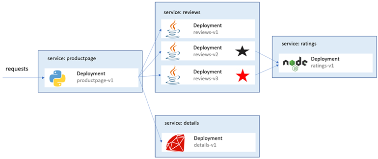
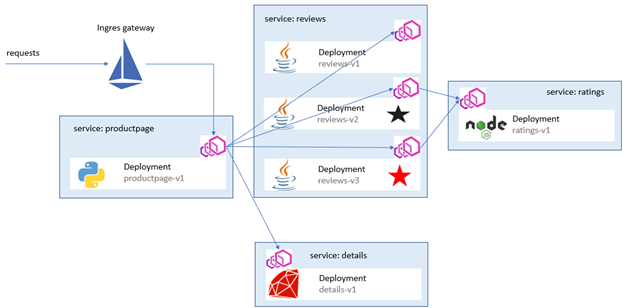

## <font color="orange"> Deploying Bookinfo App </font>
> modified version of the [Istio BookInfo sample app](https://github.com/istio/istio/tree/master/samples/bookinfo)

> Watch a video: Istio + Bookinfo (40:40):  

[](https://youtu.be/Rs08YxgF0H8 "Istio Installation")
---

### <font color="orange"> 1.2.1 Deploy BookInfo + Istio Gateway</font>


deploy the bookinfo app:
```
kubectl apply -f 01_bookinfo.yaml
```
clear the screen:
```
cls
```
check PODs:
```
kubectl get pods
```
check services:
```
kubectl get svc
```
clear the screen:
```
cls
```



show the productpage proxy setup:
```
kubectl describe pods -l app=productpage
```
clear the screen:
```
cls
```
find all proxy containers:
```
docker container ls --filter name=istio-proxy_*
```
clear the screen:
```
cls
````
check proxy processes for the product page:
```
docker container ls --filter name=istio-proxy_productpage* -q  
```
```
docker container top $(docker container ls --filter name=istio-proxy_productpage* -q)
```
clear the screen:
```
cls
````
---

### <font color="orange"> 1.2.2 Deploy Gateway </font>
deploy gateway:
```
kubectl apply -f 02_bookinfo-gateway.yaml
```
clear the screen:
```
cls
````
---

### <font color="orange"> 1.2.3 Verify the Gateway </font>
check PODs:
```
kubectl get pods
```
check gateway:
```
kubectl get gateway
```
```
kubectl get svc istio-ingressgateway -n istio-system
```
clear the screen (ensure PODs are up and running):
```
cls
````
> check http://localhost/productpage

---
### <font color="orange"> 1.2.4 Port Forward Gateway </font>
Depending on your environment port forward requests. 

port forward:
````
kubectl port-forward -n istio-system svc/istio-ingressgateway 6324:80
````
> check http://localhost:6324/productpage
----

### <font color="orange"> 1.2.5 Kiali + Prometheus + Grafana </font>
Lets have a look at the flow of traffic bweteen the services:


install prometheus:  
````
kubectl apply -f 05_prometheus.yaml
````
check prometheus service:
````
kubectl -n istio-system get svc prometheus
````
install kiali:
````
kubectl apply -f 05_kiali.yaml
````
check kiali service:
````
kubectl -n istio-system get svc kiali
````
install jaeger:  
````
kubectl apply -f 05_jaeger.yaml
````
check jaeger service:
````
kubectl -n istio-system get svc tracing
````
install grafana:
````
kubectl apply -f 05_grafana.yaml
````
check grafana service:
````
kubectl -n istio-system get svc grafana
````
clear the screen:
```
cls
````
access kiali dashboard:
```
istioctl dashboard kiali
````
access grafana dashboard:

> http://localhost:3000/dashboard/db/istio-service-dashboard

---