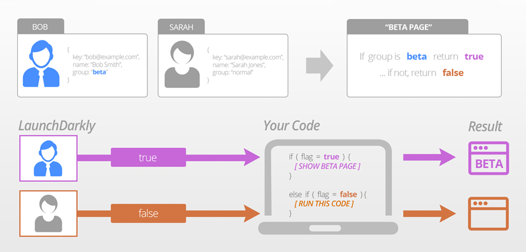

### <font color="orange"> 2.2.1 Dark Launch </font>
Dark launching is the process of releasing production-ready features to a subset of your users prior to a full release. This enables you to decouple deployment from release, get real user feedback, test for bugs, and assess infrastructure performance.  

  

> Watch a video: Dark Launch (08:49):  

[](https://youtu.be/bQUtunBWNWA "dark launch")

deploy virtualservice reviews v1 + v2 (testuser):
```
kubectl apply -f 01_reviews-v1+v2-virtualservice-testuser.yaml
```
deploy destination rule reviews v1 + v2:
```
kubectl apply -f 01_reviews-v1+v2-destination-rule-testuser.yaml
```
check reviews virtualservice:
```
kubectl describe vs reviews
```

> check http://localhost/productpage - all users see v1 except `testuser` who sees v2
 
---

### <font color="orange"> 2.2.2 Test with network delay </font>
deploy reviews-v2 - delay 2.5s:
```
kubectl apply -f 02_reviews-v2-virtualservice-testuser-delay.yaml
```
> check http://localhost/productpage - `testuser` gets delayed response, all others OK
 
---

### <font color="orange"> 2.2.3 Test with service fault </font>
deploy reviews-v2 - 503 fault 75% of requests:
```
kubectl apply -f 03_reviews-v2-virtualservice-testuser-503.yaml
```
> check http://localhost/productpage -  `testuser` gets 75% failures, all others OK 
 
---