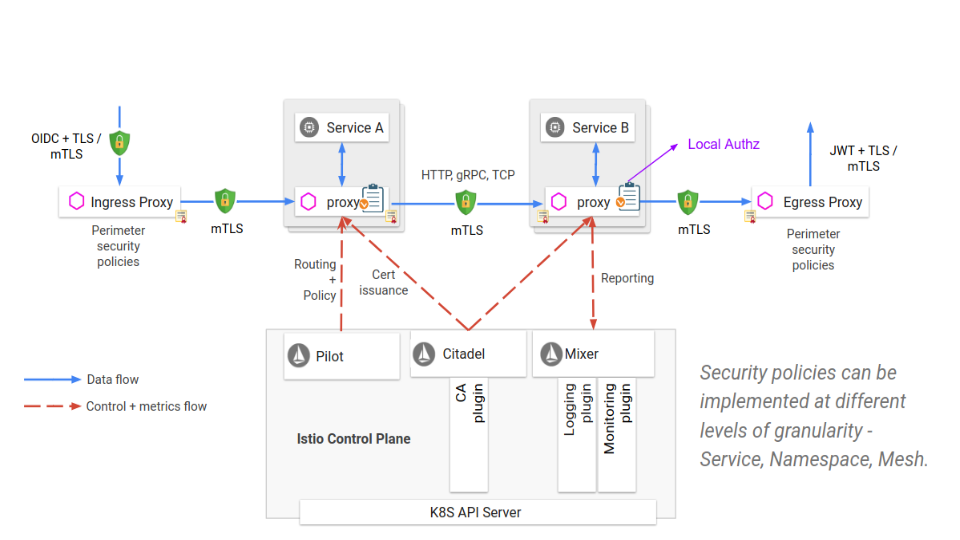
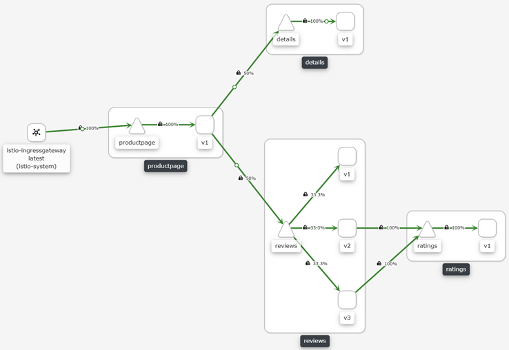

### <font color='orange'> 3.1.1 Hack the details API </font>
Mutual TLS (mTLS) authentication ensures that traffic is both secure and trusted in both directions between a client and server. It allows requests that do not log in with an identity provider (like IoT devices) to demonstrate that they can reach a given resource. Client certificate authentication is also a second layer of security for team members who both log in with an identity provider (IdP) and present a valid client certificate.  

With a root certificate authority (CA) in place, Access only allows requests from devices with a corresponding client certificate. When a request reaches the application, Access responds with a request for the client to present a certificate. If the device fails to present the certificate, the request is not allowed to proceed. If the client does have a certificate, Access completes a key exchange to verify.



Mutual TLS can be enabled on 3 levels:

<font color='teal'> Mesh: </font> Enable mTLS for the entire mesh network.  

<font color='teal'> Namespace: </font>Enable mTLS for a specific namespace. Services within the namespace will have mTLS installed and communicate using TLS. 

<font color='teal'> Service: </font>Enable mTLS for a subset of services. It can be a service on the edge that communicate with the external world and need an encrypted communication. 

> Watch a video: Istio Security (09:00):  

[](https://youtu.be/j3Mz0LS5U2s "istio security")


Istio stores mesh-scope policies in the root namespace. These policies have an empty selector apply to all workloads in the mesh.   
Policies that have a namespace scope are stored in the corresponding namespace. They only apply to workloads within their namespace.  
If you configure a selector field, the authentication policy only applies to workloads matching the conditions you configured.  

> check http://localhost/productpage

Currently there are no virtual services / destination rules or security policies applied to any of my workspaces (services).
I'm able to make a request from any service to any service (no peer authentication).

> Watch a video: Hack Services (05:39):  

[](https://youtu.be/6kJjOZorZic "hack services")


check default mesh peer authentication policy:
```
kubectl get pa --all-namespaces
```
check that there are no destination rules on the services:  
```
kubectl get destinationrules.networking.istio.io --all-namespaces -o yaml
```
find the sleep app container:
```
docker container ls --filter name=k8s_sleep
```
retrieve the container ID:
```
$id=$(docker container ls --filter name=k8s_sleep --format '{{ .ID}}')
```
run a shell in the container:
```
docker container exec -it $id sh
```
use the details API:
```
curl http://details.default.svc.cluster.local:9080/details/1
```
access kiali dashboard:
```
istioctl dashboard kiali
````
Just http requests.  



---

### <font color='orange'> 3.1.2 Secure the Istio Mesh </font>
in a new terminal session:  
enforce mTLS for all services in the istio mesh:  
<font color="teal"> STRICT </font>- only mTLS:  
<font color="teal"> PERMISSIVE </font>- allows for both http and mTLS:  
<font color="teal"> DISABLE </font>- mTLS is disabled:

> Watch a video: Secure Istio Mesh (02:48):  

[](https://youtu.be/-SnLEhVMx14 "secure mesh")

```
kubectl apply -f 02_mesh-mTLS-STRICT.yaml
```
check policy:
```
kubectl describe pa -n istio-system
```

> back to the sleep container session

find the sleep app container:
```
docker container ls --filter name=k8s_sleep
```
retrieve the container ID
```
$id=$(docker container ls --filter name=k8s_sleep --format '{{ .ID}}')
```
run a shell in the container:
```
docker container exec -it $id sh
```
use the details API:  
it fails as the default namespace is now STRICT mTLS:
does not have the required istio cert:  
```
curl http://details.default.svc.cluster.local:9080/details/1
```
port forward:  
```
kubectl port-forward -n istio-system svc/istio-ingressgateway 6324:80
```
> http://localhost/productpage  
> http://localhost:6324/productpage

access kiali dashboard:
```
istioctl dashboard kiali
````
notice the change to mTLS.  


remove mesh mTLS:
```
kubectl delete pa -n istio-system mesh-strict-policy
```
---

### <font color='orange'> 3.1.3 Secure the default Namespace </font>
Let’s ensure that all services in the default namespace should be secure. 


> Watch a video: Secure default Namespace (03:49):  

[](https://youtu.be/-SnLEhVMx14 "secure namespace")

```
kubectl apply -f 03_namespace-mTLS-PERMISSIVE.yaml
```
check policy:
```
kubectl describe pa -n default
```

> back to the sleep container session

find the sleep app container:
```
docker container ls --filter name=k8s_sleep
```
retrieve the container ID
```
$id=$(docker container ls --filter name=k8s_sleep --format '{{ .ID}}')
```
run a shell in the container:
```
docker container exec -it $id sh
```
use the details API:  
default namespace is now PERMISSIVE mTLS:
accepts http requests &mTLS:  
```
curl http://details.default.svc.cluster.local:9080/details/1
```
port forward:  
```
kubectl port-forward -n istio-system svc/istio-ingressgateway 6324:80
```
> http://localhost/productpage  
> http://localhost:6324/productpage

access kiali dashboard:
```
istioctl dashboard kiali
````
notice the change to mTLS.  


remove namespace mTLS:
```
kubectl delete pa -n default namespace-permissive-policy
```

---

### <font color='orange'> 3.1.4 Secure a Service </font>
To set a peer authentication policy for a specific workload (service), you must configure the selector section and specify  
the labels that match the desired workload. However, Istio cannot aggregate workload-level policies for outbound mutual TLS traffic to a service. 
Configure a destination rule to manage that behavior.  

change default namespace to STRICT mTLS:
```
kubectl apply -f 03_namespace-mTLS-STRICT.yaml
```
check policy:
```
kubectl describe pa -n default
```
change details service to ISTIO-MUTUAL:
```
kubectl apply -f 03_details-ISTIO-MUTUAL.yaml
```
check policy:
```
kubectl describe dr details
```

> back to the sleep container session

find the sleep app container:
```
docker container ls --filter name=k8s_sleep
```
retrieve the container ID
```
$id=$(docker container ls --filter name=k8s_sleep --format '{{ .ID}}')
```
run a shell in the container:
```
docker container exec -it $id sh
```
use the details API:  
it accepts http requests as the default namespace has been configured as PERMISSIVE:
```
curl http://details.default.svc.cluster.local:9080/details/1
```
port forward:  
```
kubectl port-forward -n istio-system svc/istio-ingressgateway 6324:80
```
> http://localhost/productpage  
> http://localhost:6324/productpage

access kiali dashboard:
```
istioctl dashboard kiali
````

> check http://localhost/productpage  
> check http://localhost:6324/productpage

---